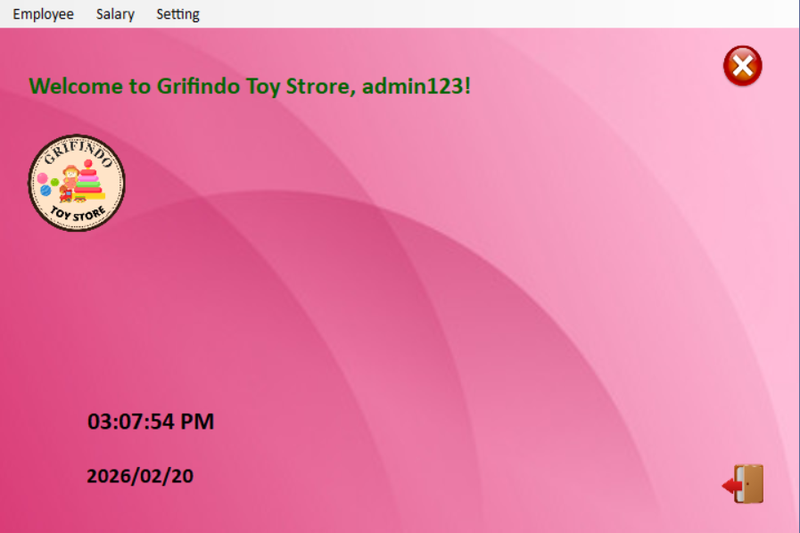
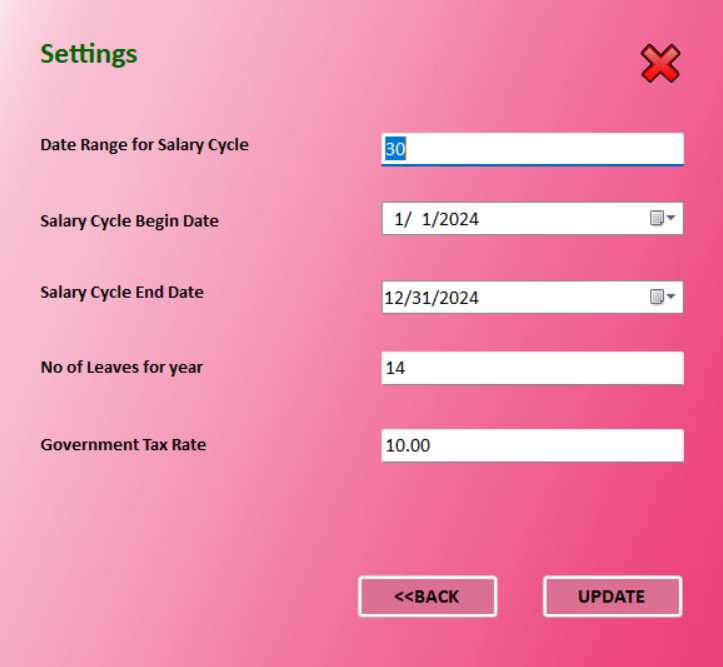

# Grifindo Toy Store - Payroll Management System

A C# Windows Forms desktop application designed to manage employee payroll operations for a toy store, including authentication, salary calculation, and employee management.

## Features

- **User Authentication** - Secure login system with role-based access
- **Employee Registration** - Add and manage employee details
- **Salary Calculation** - Calculate employee salaries with overtime, allowances, and deductions
- **Settings Management** - Configure system-wide payroll settings

## Technology Stack

- **Framework:** .NET Framework 4.8
- **Language:** C#
- **Database:** Microsoft SQL Server
- **UI:** Windows Forms

## Database Setup

The application uses MS SQL Server with a database named `Grifindo`. Run the `SetupDatabase.sql` script to create all required tables:

```
sql
sqlcmd -S YOUR_SERVER_NAME -E -i SetupDatabase.sql
```

### Default Login Credentials
- **Admin:** Username: `admin`, Password: `admin123`
- **User:** Username: `user`, Password: `user123`

## Project Structure

```
AssignmentProject/
├── App.config           - Application configuration
├── AssignmentProject.csproj - Project file
├── Program.cs           - Application entry point
├── Form1.cs            - Login form
├── Form2.cs            - Main menu
├── Form3.cs            - Employee registration
├── Form4.cs            - Salary calculation
├── Form5.cs            - Settings
├── SetupDatabase.sql   - Database setup script
├── README.md           - This file
└── .gitignore          - Git ignore rules
```

## Building the Project

Open the solution in Visual Studio 2022 and build:

```
AssignmentProject.sln
```

Or use MSBuild:
```
msbuild AssignmentProject.csproj /p:Configuration=Debug
```

## Database Configuration

The connection string is configured in each form file. Update the server name (`DESKTOP-PCPS2U4`) to match your SQL Server:

```
csharp
SqlConnection conn = new SqlConnection(@"Data Source=YOUR_SERVER_NAME;Initial Catalog=Grifindo;Integrated Security=True");
```

## License

This project is for educational purposes.

## Screenshots

### Login Page


### Dashboard


### Employee Registration


### Salary Calculation


### Settings
